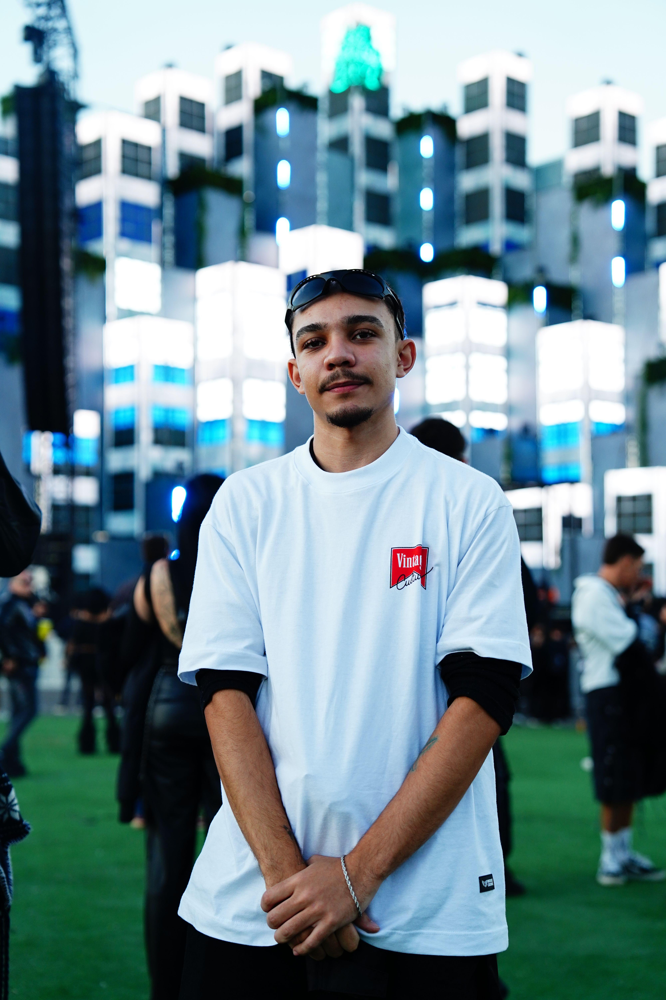

<table>
  <tr>
    <td>
      
    </td>
    <td>
      
    </td>
  </tr>
</table>

 

<h3>Desenvolvedor em formação • Tecnologia • Desenvolvimento de Software</h3>

  Estudante de Análise e Desenvolvimento de Sistemas, construindo conhecimento 
  através de projetos e experiências práticas.

  

---

## 👨‍💻 Sobre mim

Sou José Gabriel, desenvolvedor em formação e estudante de Análise e Desenvolvimento de Sistemas.

Tenho interesse em desenvolvimento de software, tecnologia e resolução de problemas. Busco transformar o conhecimento adquirido nos estudos em projetos práticos, ampliando continuamente minha experiência com diferentes tecnologias.

Atualmente, venho desenvolvendo conhecimentos principalmente em **Java, Python, Harbour, ADVPL, SQL, Power BI e tecnologias do ecossistema TOTVS Protheus**.

---

## 🛠️ Tecnologias & Ferramentas

### 💻 Linguagens

### 🗄️ Dados & Desenvolvimento

### 🔧 Ferramentas

---

## 🚀 Projeto em destaque

  Repositório dedicado aos estudos e atividades práticas da minha jornada
  de desenvolvimento, reunindo exercícios, algoritmos e projetos acadêmicos.

<a href="https://github.com/jgabrieljesuss-hue/jornadadev">
  <strong>→ Ver projeto no GitHub</strong>
</a>

---

## 📚 Atualmente estudando

`Java` · `Python` · `Harbour` · `ADVPL` · `SQL` · `TOTVS Protheus`

---

## 🐍 Contribuições

---

## 🌐 Onde me encontrar

💬 Vamos conversar? Estou sempre aberto a novas conexões e oportunidades.

---

### 💜 Construindo conhecimento. Desenvolvendo projetos. Evoluindo todos os dias.

 

